# Diagrama de Componentes — PetCare

> Plataforma híbrida (app móvil + web) de cuidado preventivo de mascotas mediante IA.
> Este documento identifica los componentes de software, sus responsabilidades e interacciones,
> y justifica las decisiones de **tecnología** y **base de datos** frente a los requerimientos
> funcionales (RF) y no funcionales (RNF) del proyecto.

---

## 1. Contexto y alcance

PetCare conecta a **propietarios** (app móvil + web), **veterinarios**, **personal de clínica** y
**administradores** (web) con una API única. El sistema centraliza el historial clínico multi-sede,
gestiona citas con confirmación/reprogramación y lista de espera, calcula vencimientos de
vacunas/desparasitaciones, envía recordatorios por WhatsApp y push, y genera alertas y reportes
basados en IA.

La figura contempla componentes **internos** (desplegados/propios) y **externos** (proveedores de
servicio).

---

## 2. Identificación de componentes

| Componente | Tipo | Responsabilidad principal arquetípica |
|---|---|---|
| App Móvil – Propietario | Cliente | Confirmar/cancelar/reprogramar citas (HU-04, HU-05), lista de espera (HU-07), historial y vacunas (HU-09), QR de emergencia (HU-10), alertas IA (HU-11), recibir push (HU-01) |
| App Web – Clínica (frontend por rol) | Cliente | Tablero de citas del día (RF-11), revisión semanal de vencimientos (HU-02), registro de vacunas/desparasitaciones (HU-03), reportes gerenciales (RF-14), historial consolidado (HU-08) |
| API Backend (FastAPI) | Núcleo | Orquestación de servicios, autenticación, validación, exposición REST `/api/v1` para web y móvil |
| Servicio de Autenticación + RBAC | Servicio | Login JWT, control de acceso por rol (RNF-04): administrador, veterinario, personal clínica, propietario |
| Servicio de Mascotas y Propietarios | Servicio | CRUD de propietarios y mascotas, perfil de emergencia |
| Servicio de Historial Clínico | Servicio | Consolidación del historial multi-sede (RNF-03), vistas de vacunas/exámenes/consultas (RF-12, RF-13), documentos PDF |
| Servicio de Citas y Agenda | Servicio | Crear, confirmar, cancelar, reprogramar citas (RF-07, RF-08), liberación automática de cupos (RF-09) |
| Servicio de Lista de Espera | Servicio | Inscripción a horarios llenos y asignación automática del primero de la cola (RF-10, HU-07) |
| Servicio de Notificaciones (multi-canal) | Servicio | Orquestación de recordatorios por WhatsApp y push (RNF-06), segundo recordatorio (RF-06, HU-01) |
| Servicio IA Preventiva | Servicio | Triaje de síntomas y resúmenes clínicos (Gemini + motor de reglas offline), alertas por desviación >15 % (HU-11) |
| Servicio de Reportes y Cumplimiento | Servicio | Reportes gerenciales de vacunación/desparasitación (RF-14) y reporte semanal para clínica (RF-04, HU-02) |
| Servicio QR de Emergencia | Servicio | Perfil público accesible sin sesión mediante token QR (HU-10) |
| Cola de Tareas (Celery) | Infraestructura | Trabajos planificados: cálculo semanal de vencimientos (RNF-07), envío de recordatorios (RF-05, RF-06), liberación de cupos no confirmados (RF-09) |
| Redis | Infraestructura | Caché + broker de Celery + pub/sub para propagación entre instancias/sedes (RNF-03, RNF-05) |
| Base de Datos PostgreSQL | Infraestructura | Fuente única de verdad; ACID; datos cifrados en reposo (RNF-04, RNF-08) |
| Almacén de Objetos (S3) | Infraestructura | Exámenes, radiografías y PDFs descargables (HU-09) |
| WhatsApp Business API | Externo | Canal de recordatorios y segundo recordatorio (RNF-06) |
| Firebase Cloud Messaging | Externo | Notificaciones push a la app móvil (RNF-06) |
| Google Gemini API | Externo | Generación de resúmenes IA y análisis; con respaldo del motor de reglas local |

---

## 3. Diagrama de componentes

```mermaid
flowchart TB
    subgraph CLIENTES["Clientes"]
        APP_WEB["App Web Clínica (React + Vite)"]
        APP_MOVIL["App Móvil Propietario (React Native + Expo)"]
        QR_WEB["Perfil QR Emergencia (acceso público)"]
    end
    subgraph BACKEND["Backend — API FastAPI"]
        API["API Backend (FastAPI)"]
        AUTH["Servicio Autenticación + RBAC JWT"]
        PETS["Servicio Mascotas y Propietarios"]
        HIST["Servicio Historial Clínico"]
        APPT["Servicio Citas y Agenda"]
        WAIT["Servicio Lista de Espera"]
        NOTIF["Servicio Notificaciones"]
        IA["Servicio IA Preventiva"]
        REP["Servicio Reportes y Cumplimiento"]
    end
    subgraph INFRA["Infraestructura y Tareas"]
        CELERY["Cola de Tareas (Celery)"]
        REDIS[("Redis — caché + broker + pub/sub")]
        DB[("Base de Datos PostgreSQL")]
        S3[("Almacén de Objetos (S3)")]
    end
    subgraph EXTERNO["Proveedores externos"]
        WA["WhatsApp Business API"]
        FCM["Firebase Cloud Messaging"]
        GEMINI["Google Gemini API"]
    end

    APP_WEB -->|"HTTPS /api/v1"| API
    APP_MOVIL -->|"HTTPS /api/v1"| API
    QR_WEB -->|"GET token público"| API

    API --> AUTH
    API --> PETS
    API --> HIST
    API --> APPT
    API --> NOTIF
    API --> IA
    API --> REP

    AUTH -->|"valida credenciales y roles"| DB
    PETS -->|"CRUD mascotas y propietarios"| DB
    HIST -->|"historial consolidado multi-sede"| DB
    HIST -->|"exámenes y PDF"| S3
    HIST -.->|"lectura rápida"| REDIS
    APPT -->|"transacciones agenda/cupos"| DB
    APPT -->|"libera cupos y asigna"| WAIT
    WAIT -.->|"cola por horario"| REDIS

    NOTIF -->|"recordatorios WhatsApp"| WA
    NOTIF -->|"recordatorios push"| FCM

    IA -->|"triaje y resúmenes"| GEMINI
    IA -->|"persiste consultas y alertas"| DB

    REP -->|"consultas de cumplimiento"| DB

    CELERY -->|"consume y programa tareas"| REDIS
    CELERY -->|"lee pacientes y vencimientos"| DB
    CELERY -->|"dispara recordatorios"| NOTIF
    CELERY -->|"actualiza estados de cita"| APPT

    API -.->|"cache / sincronización entre sedes"| REDIS
```

> Nota: el diagrama se renderiza automáticamente en GitHub, VS Code y Mermaid Live.
> Exportado a imagen: `docs/arquitectura/componentes.png`.

---

## 4. Decisiones de tecnología

| Capa | Tecnología | Justificación (requisito) |
|---|---|---|
| Backend / API | **FastAPI + SQLAlchemy 2.0 + Pydantic 2** (ya en uso) | Alto rendimiento async, documentación automática, validación tipada; alinea con RNF-07 (batch <5 min) y RNF-02 (disponibilidad). |
| Migraciones | **Alembic** | Evolución controlada del esquema al crecer a nuevas sedes (RNF-05). |
| Web | **React 18 + Vite + Tailwind** (ya en uso) | Mantiene el stack existente; flujos de ≤3 pasos (RNF-01) desde componentes UI sencillos. |
| Móvil | **React Native + Expo** | Código compartido con el web, acceso a push nativo (RNF-06) y QR (HU-10); la API única sirve a ambas plataformas. |
| Autenticación | **JWT + RBAC por rol** (ya en uso) | Acceso basado en roles (RNF-04); tokens de corta duración + refresh. |
| Tareas planificadas | **Celery + Redis (beat)** | Recordatorios a 24-48 h, segundo recordatorio a los 3 días, liberación de cupos a 12 h, reporte semanal (RF-04, RF-05, RF-06, RF-09, HU-01, HU-02). |
| Notificaciones | **Patrón proveedor: FCM (push) + WhatsApp Business Cloud API** | Multi-canal por diseño, extensible a SMS/e-mail (RNF-06). El `NotificationService` se convierte en orquestador. |
| IA | **Google Gemini** (ya integrado) + **motor de reglas offline** | Triaje y resúmenes con respaldo offline si no hay API key; alertas por desviación >15 % con comparación de últimos 3 registros (HU-11, HU-03). |
| Almacenamiento de archivos | **S3 compatible (MinIO en dev / AWS S3 en prod)** | Descarga y compartición de exámenes en PDF (HU-09). |
| Caché | **Redis** | Lectura rápida de historiales, cola de lista de espera, broker de Celery, pub/sub para propagación <1 min (RNF-03). |
| Contenedores | **Docker + docker-compose** | Despliegue reproducible y escalable por sedes (RNF-05). |
| Observabilidad | **Logs estructurados + Sentry** (Prometheus/Grafana posterior) | Disponibilidad ≥99 % (RNF-02) y trazabilidad de la aplicación de productos (RNF-08). |

---

## 5. Decisión de la base de datos

**Motor: PostgreSQL 16** (frente al SQLite actual, que queda solo para desarrollo local y tests).

| Requisito | Por qué PostgreSQL |
|---|---|
| **RNF-03** — historial sincronizado entre sedes en <1 min | Una sola fuente de verdad centralizada: cualquier registro es visible para todas las sedes en milisegundos. Un SQLite por sede imposibilitaría la consolidación sin replicación manual. |
| **RNF-05** — crecer a nuevas sedes sin rediseño | PostgreSQL soporta N clínicas (i.e., N registros `clinicas`) como datos, no como infraestructura; basta añadir filas, sin cambiar arquitectura. |
| **RNF-07** — cálculo semanal sobre toda la base en <5 min | Índices, particionamiento por fecha de vencimiento y recorrido con cursor: pasan sin problema la exigencia incluso con decenas de miles de mascotas. |
| **RNF-04** — cifrado en reposo y datos de salud | Cifrado del volumen (disco) + columnas sensibles (teléfono, datos médicos) con **pgcrypto**; cifrado en tránsito vía TLS en la conexión de la API. |
| **RNF-08** — productos trazables a veterinario y lote, sin edición retroactiva | Transacciones ACID, claves foráneas y `ON DELETE RESTRICT` + triggers de auditoría: el registro de vacuna/desparasitación queda inmutable y trazable. |
| **Concurrencia** de agenda y lista de espera | `SELECT ... FOR UPDATE` y niveles de aislamiento evitan doble asignación de un cupo liberado (RF-09, RF-10), imposible de garantizar bien con el bloqueo de archivo de SQLite. |

El esquema `database/schema.sql` ya fue diseñado "compatible con PostgreSQL y SQLite", por lo que
la migración es de bajo riesgo: cambiar `DATABASE_URL`, usar driver `asyncpg`/`psycopg`, y añadir
Alembic para versionar el esquema.

**Esquema de datos + Redis:**
- Tablas relacionales: `roles`, `usuarios`, `clinicas`, `personal_clinica`, `mascotas`, `vacunas`,
  `medicamentos`, `registros_peso`, `consultas_medicas`, `documentos_salud`, `citas`,
  `consultas_ia`, `alertas_evolucion_ia`, `notificaciones` (ya existentes en `schema.sql`).
- Datos nuevas necesarias en la siguiente iteración: **protocolos de refuerzo** (RF-02/RF-03),
  **slots de agenda/horarios disponibles** y **lista de espera** (RF-08/RF-10).
- En Redis: cola de lista de espera por slot y cache del historial consolidado (RNF-03).

---

## 6. Trazabilidad RF/RNF → componente

| ID | Requisito | Componente principal |
|---|---|---|
| RF-01 | Registro vacuna/desparasitación | App Web → API → Servicio Historial Clínico → PostgreSQL |
| RF-02 / RF-03 | Protocolos de refuerzo y cálculo de próxima fecha | Servicio Historial Clínico + PostgreSQL |
| RF-04 | Alerta semanal al personal de clínica | Celery + Servicio Reportes + App Web (tablero) |
| RF-05 / RF-06 | Recordatorio y segundo recordatorio | Celery → Servicio Notificaciones → WhatsApp/push |
| RF-07 / RF-08 / RF-09 | Confirmar, reprogramar, liberar cupo | App Móvil → Servicio Citas y Agenda → PostgreSQL |
| RF-10 | Lista de espera | Servicio Lista de Espera + Redis |
| RF-11 | Tablero del día | Servicio Citas + App Web |
| RF-12 / RF-13 | Historial centralizado y consulta | Servicio Historial Clínico + App Móvil/Web |
| RF-14 | Reportes gerenciales | Servicio Reportes + App Web |
| RNF-03 | Sync <1 min | PostgreSQL centralizada + Redis pub/sub |
| RNF-04 | Seguridad | JWT/RBAC (AUTH) + cifrado PostgreSQL (pgcrypto) + TLS |
| RNF-06 | Multi-canal | Abstracción de proveedores (WhatsApp, FCM) |
| RNF-07 | Batch semanal <5 min | Celery + PostgreSQL indexado/particionado |
| RNF-08 | Auditabilidad | Triggers PostgreSQL + FK restrictivas |

---

## 7. Brechas entre el código actual y la arquitectura objetivo

1. **SQLite → PostgreSQL**: cambiar `DATABASE_URL` en `backend/app/core/config.py`, añadir Alembic.
2. **Tareas planificadas**: crear worker Celery para vencimientos, recordatorios y liberación de cupos
   (hoy no existen; `NotificationService` solo maneja notificaciones internas).
3. **Proveedores de notificación**: concretar FCM y WhatsApp Cloud API detrás de la interfaz de canales.
4. **Agenda avanzada**: agregar `slots`/horarios disponibles y tabla de lista de espera.
5. **App móvil**: el repositorio aún no tiene el proyecto React Native/Expo (la API ya lo contempla).
6. **Servicio de Reportes**: implementar el cálculo de cumplimiento (RF-14) sobre el historial.